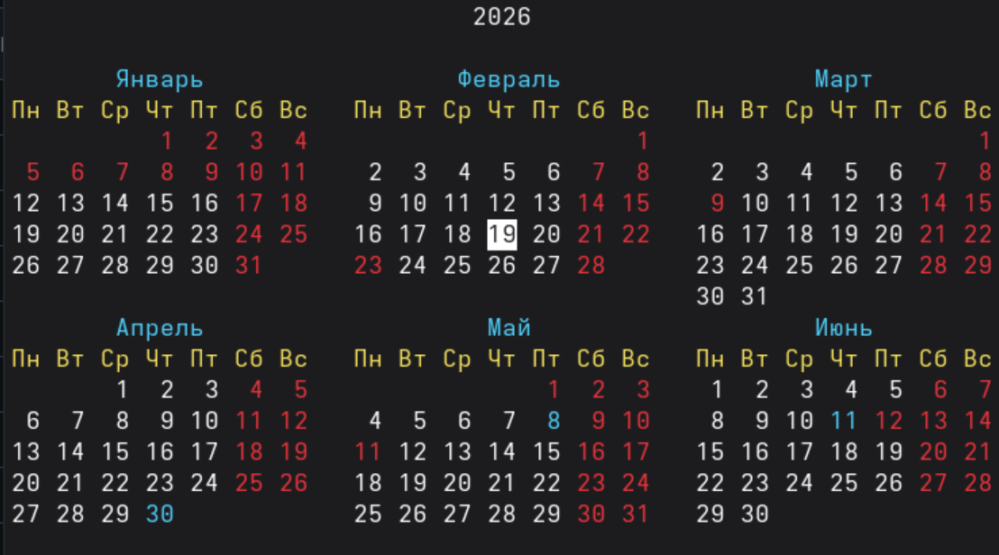

# cal

Terminal calendar — a Rust rewrite of the `cal` utility from util-linux.



## Features

- **Flexible display**: single month, three months, year, arbitrary number of months
- **Week start**: Monday `-m` (ISO) or Sunday `-s` (US)
- **Week numbers**: `-w` with numbering system choice (`--week-type iso` or `us`)
- **Julian days**: `-j` shows day of year instead of date
- **Vertical mode**: `-v` for compact day-by-column layout
- **Custom reform**: `--reform 1752|gregorian|iso|julian` for different calendar systems
- **Today highlight**: inverse color for current day
- **Weekend and holiday highlight**: colors for Saturday, Sunday, and official holidays
- **Plugins**: dynamic loading of holiday highlighter plugins via API

## Installation

```bash
cargo build --release
```

Binary will be in `target/release/cal`.

### Building with plugins

The holiday highlighter plugin is built in the workspace:

```bash
cargo build --release --workspace
```

Plugin `libholiday_highlighter.so` will be in `target/release/`.

## Commands

### Basic usage

| Command | Description |
|---------|----------|
| `cal` | Current month |
| `cal 2026` | Entire year 2026 |
| `cal 2 2026` | February 2026 |
| `cal 15 9 2026` | September 2026 with 15th highlighted |
| `cal december 2025` | December 2025 (month names supported) |

### Display modes

| Command | Description |
|---------|----------|
| `cal -y` | Entire year (12 months) |
| `cal -Y` | Next 12 months from current |
| `cal -3` | Three months: previous, current, next |
| `cal -n 6` | Show 6 months |
| `cal --span -n 12` | 12 months centered on current month |

### Output format

| Command | Description |
|---------|----------|
| `cal -v` | Vertical mode (days in columns) |
| `cal -j` | Julian days (day of year 1-365/366) |
| `cal -w` | With week numbers |
| `cal --week-type us` | Weeks by US standard (starting Sunday) |
| `cal -c 2` | Force 2 columns for multi-month mode |
| `cal -c auto` | Auto-detect columns by terminal width |

### Calendar options

| Command | Description |
|---------|----------|
| `cal -m` | Week starts Monday (ISO, default) |
| `cal -s` | Week starts Sunday (US style) |
| `cal --reform 1752` | 1752 reform (skip Sep 3-13 in Great Britain) |
| `cal --reform gregorian` | Always Gregorian calendar |
| `cal --reform julian` | Always Julian calendar |
| `cal --iso` | ISO 8601 (alias for `--reform iso`) |

### Output and colors

| Command | Description |
|---------|----------|
| `cal --color` | Disable colors (monochrome output) |
| `cal -H` | Holiday highlight via isdayoff.ru API (requires plugin) |

### Combined examples

```bash
# Year with week numbers and holidays
cal -y -w -H

# Three months vertically with holidays
cal -3 -v -H

# 6 months in 2 columns
cal -n 6 -c 2

# February 2026 with Julian days
cal -j 2 2026

# Next 12 months centered
cal --span -Y
```

## Plugins

### Holiday Highlighter

Plugin for highlighting official holidays via isdayoff.ru API.

#### Supported countries

| Code | Country | Locales |
|------|---------|---------|
| RU | Russia | ru_RU, ru_BY, ru_KZ, ru_UZ, ru_LV |
| BY | Belarus | be_BY, ru_BY |
| KZ | Kazakhstan | kk_KZ, ru_KZ |
| US | USA | en_US, en |
| UZ | Uzbekistan | uz_UZ, ru_UZ |
| TR | Turkey | tr_TR |
| LV | Latvia | lv_LV, ru_LV |

Country is auto-detected from `LC_ALL`, `LC_TIME`, or `LANG`.

#### Day types

| Code | Meaning | Color |
|------|---------|-------|
| 0 | Working day | — |
| 1 | Weekend | Red |
| 2 | Shortened day | Teal |
| 8 | Public holiday | Red |

#### Installing the plugin

After building the workspace, the plugin is in `target/release/libholiday_highlighter.so`.

For system installation:

```bash
# User-local
mkdir -p ~/.local/lib/cal/plugins
cp target/release/libholiday_highlighter.so ~/.local/lib/cal/plugins/

# System-wide (requires root)
sudo mkdir -p /usr/lib/cal/plugins
sudo cp target/release/libholiday_highlighter.so /usr/lib/cal/plugins/
```

#### API

The plugin uses [isdayoff.ru API](https://isdayoff.ru/):
- `GET /api/getdata?year=YYYY&month=MM&pre=1` — monthly data
- `GET /api/getdata?year=YYYY&pre=1` — yearly data

Parameter `pre=1` includes pre-holiday shortened days information.

## Environment variables

| Variable | Description |
|----------|-------------|
| `LC_ALL` | Priority locale for month and day names |
| `LC_TIME` | Locale for date formatting |
| `LANG` | Fallback locale |
| `CAL_TEST_TIME` | Fixed date for testing (format YYYY-MM-DD) |

## Localization

Month names are supported in Russian and English:

```bash
cal январь 2026
cal February 2026
cal 1 2026
```

Weekdays are abbreviated to 2 characters according to locale:
- **ru_RU**: Пн, Вт, Ср, Чт, Пт, Сб, Вс
- **en_US**: Mo, Tu, We, Th, Fr, Sa, Su

## Differences from util-linux cal

- Vertical mode support (`-v`)
- Dynamic plugins
- Automatic locale detection
- Flexible calendar reform configuration
- Color output with today/weekend/holiday highlights
